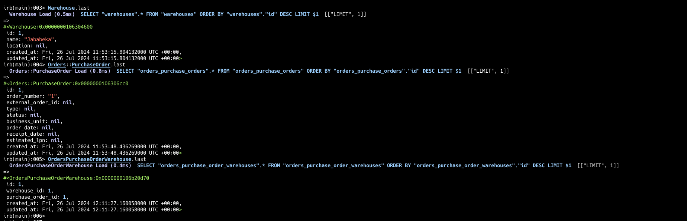
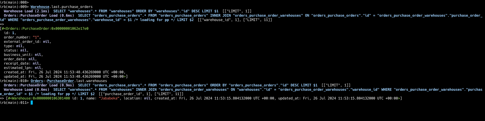

# Steps followed to setup this

- Create rails app using `rails new lego_spike -d postgresql --css tailwind`
- Create `packages` folders
- Move to `packages` folder
- Created engine inside packages folder `rails plugin new orders --mountable --skip-git`
- Load the packages folder in application.rb [application.rb](https://github.com/SujayPrabhu96/lego_spike/blob/main/config/application.rb#L9)
- Generate resources in engine using `rails scaffold`
- Copy the migrations to main application by running `rails orders:install:migrations` in main application root directory
- Run `db:migrate` to apply the engine migrations to main application
- Create the resources in main application using `rails scaffold` (eg: warehouse)
- We can override the engine models/controllers from [application.rb](https://github.com/SujayPrabhu96/lego_spike/blob/main/config/application.rb#L30-L37)
- Now, to access `Warehouse` via `Orders::PurchaseOrder`, override the engine model in `app/overrides/models/<engine-name>/<model-name>_override.rb` [Here](https://github.com/SujayPrabhu96/lego_spike/blob/main/app/overrides/models/orders/purchase_order_override.rb)

# Images

## Accessing the records created for each resource (Warehouse, PurchaseOrder and Join table)

## Accessing the records based on association (purchase order via warehouse and warehouse via purchase order)

